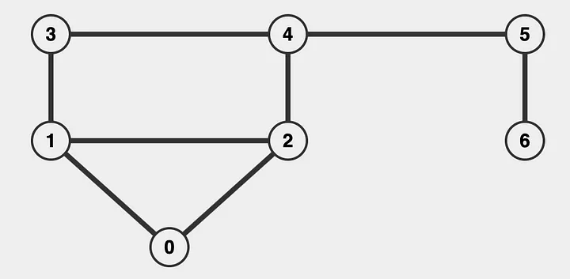
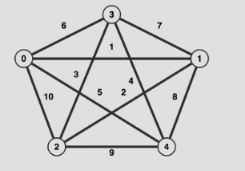
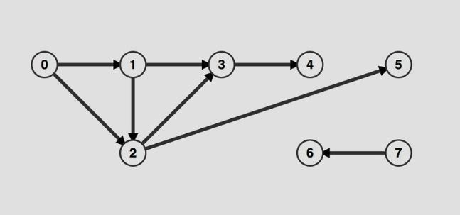
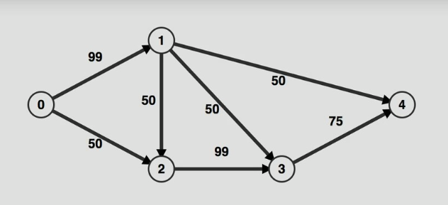

# Graphs

- `Directed graph`: The connections between nodes (called "edges") have a direction. It means each edge goes from one node to another in a specific way, like a one-way street. For example, if there is an edge from Node A to Node B, it doesn't mean there's automatically an edge from Node B to Node A.

- `Undirected graph`: The edges between nodes don't have a direction. It means the connection goes both ways, like a two-way street. If there's an edge between Node A and Node B, you can travel from A to B and from B to A.

- `Weighted graph`: Each edge has a value or "weight" associated with it. This weight could represent something like distance, cost, or time between two nodes. For example, if nodes represent cities, the weight on an edge could be the distance between those cities.

- `Unweighted graph`: The edges between nodes do not have any weight or value associated with them. All connections are considered equal. In this case, the graph only shows whether nodes are connected, without any extra information about the connection.

- `Cyclical graph`: This type of graph contains at least one cycle. A cycle is a path where you can start at one node, follow a series of edges, and eventually return to the same starting node without retracing any edge. For example, if you go from Node A to Node B, then to Node C, and back to Node A, that forms a cycle.

- `Acyclical graph (or uncyclical graph)`: This graph has no cycles, meaning there is no way to start at one node and follow a path that brings you back to the same node. All paths in the graph lead somewhere else without looping back.

- ## `Unweighted` `Undirected` `Acyclycal` Graph:

    
    
- ## `Weighted` `Undirected` `Cyclical` Graph:  
    

- ## `Unweighted` `Undirected` `Acyclical` Graph:  
    

- ## `Weighted` `directed` `Cyclical` Graph:  
    

---

- `Pros`
    - Relationships
 n
- `Cons`
    - Scaling is hard

### Examples: 
- [Graphs in Adjacency and Edge](./HandsOn/ex1.js)
- [Unweighted Undirected graph Implementation](./HandsOn/ex2.js)

### Additional Resources:
- [Data Structures: Graphs](https://medium.com/@e.owuusu/data-structures-graphs-ac691fc14eb5)
