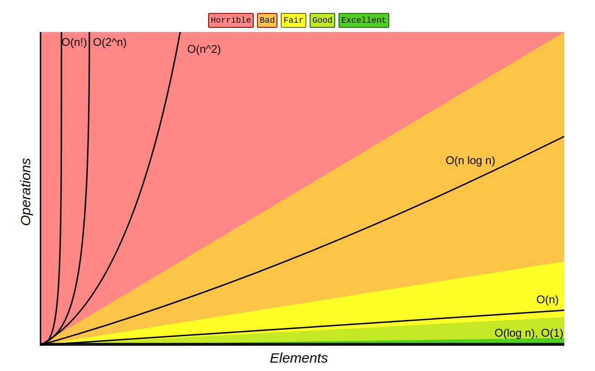

# Big O Notes.

- [ZTE BigO Cheat Sheet](https://zerotomastery.io/cheatsheets/big-o-cheat-sheet/?utm_source=udemy&utm_medium=coursecontent)

## **Hands On**
- [Exercise 1](HandsOn/ex1.js) - O(n) example.
- [Exercise 2](HandsOn/ex2.js) - O(1) example.
- [Exercise 3 - Challenge](HandsOn/ex3_challenge.js) - Calculation of BigO example.
- [Exercise 4 - Challenge](HandsOn/ex4_challenge.js) - Calculation of BigO example.
- [Exercise 5](HandsOn/ex5.js) - O(n^2) example.
- [Exercise 6](HandsOn/ex5.js) - O(n^2) example. (Relevant to rule 4.)

